```mermaid
flowchart TB
    subgraph current["LazyChat.csproj"]
        MAIN["<b>⚙️&nbsp;LazyChat.csproj</b><br/><small>net48</small>"]
        click MAIN "#lazychatlazychatcsproj"
    end

```

# Projects and dependencies analysis

This document provides a comprehensive overview of the projects and their dependencies in the context of upgrading to .NETCoreApp,Version=v10.0.

## Table of Contents

- [Executive Summary](#executive-Summary)
  - [Highlevel Metrics](#highlevel-metrics)
  - [Projects Compatibility](#projects-compatibility)
  - [Package Compatibility](#package-compatibility)
  - [API Compatibility](#api-compatibility)
- [Aggregate NuGet packages details](#aggregate-nuget-packages-details)
- [Top API Migration Challenges](#top-api-migration-challenges)
  - [Technologies and Features](#technologies-and-features)
  - [Most Frequent API Issues](#most-frequent-api-issues)
- [Projects Relationship Graph](#projects-relationship-graph)
- [Project Details](#project-details)

  - [LazyChat\LazyChat.csproj](#lazychatlazychatcsproj)

## Executive Summary

### Highlevel Metrics

| Metric | Count | Status |
| :--- | :---: | :--- |
| Total Projects | 1 | All require upgrade |
| Total NuGet Packages | 3 | All compatible |
| Total Code Files | 16 |  |
| Total Code Files with Incidents | 8 |  |
| Total Lines of Code | 3303 |  |
| Total Number of Issues | 1460 |  |
| Estimated LOC to modify | 1456+ | at least 44.1% of codebase |

### Projects Compatibility

| Project | Target Framework | Difficulty | Package Issues | API Issues | Est. LOC Impact | Description |
| :--- | :---: | :---: | :---: | :---: | :---: | :--- |
| [LazyChat\LazyChat.csproj](#lazychatlazychatcsproj) | net48 | 🟡 Medium | 2 | 1456 | 1456+ | ClassicWinForms, Sdk Style = False |

### Package Compatibility

| Status | Count | Percentage |
| :--- | :---: | :---: |
| ✅ Compatible | 3 | 100.0% |
| ⚠️ Incompatible | 0 | 0.0% |
| 🔄 Upgrade Recommended | 0 | 0.0% |
| ***Total NuGet Packages*** | ***3*** | ***100%*** |

### API Compatibility

| Category | Count | Impact |
| :--- | :---: | :--- |
| 🔴 Binary Incompatible | 1393 | High - Require code changes |
| 🟡 Source Incompatible | 63 | Medium - Needs re-compilation and potential conflicting API error fixing |
| 🔵 Behavioral change | 0 | Low - Behavioral changes that may require testing at runtime |
| ✅ Compatible | 2946 |  |
| ***Total APIs Analyzed*** | ***4402*** |  |

## Aggregate NuGet packages details

| Package | Current Version | Suggested Version | Projects | Description |
| :--- | :---: | :---: | :--- | :--- |
| MessagePack | 3.1.4 |  | [LazyChat.csproj](#lazychatlazychatcsproj) | ✅Compatible |
| System.Memory | 4.6.3 |  | [LazyChat.csproj](#lazychatlazychatcsproj) | 框架引用中包含 NuGet 包功能 |
| System.Threading.Tasks.Extensions | 4.6.3 |  | [LazyChat.csproj](#lazychatlazychatcsproj) | 框架引用中包含 NuGet 包功能 |

## Top API Migration Challenges

### Technologies and Features

| Technology | Issues | Percentage | Migration Path |
| :--- | :---: | :---: | :--- |
| Windows Forms | 1393 | 95.7% | Windows Forms APIs for building Windows desktop applications with traditional Forms-based UI that are available in .NET on Windows. Enable Windows Desktop support: Option 1 (Recommended): Target net9.0-windows; Option 2: Add <UseWindowsDesktop>true</UseWindowsDesktop>; Option 3 (Legacy): Use Microsoft.NET.Sdk.WindowsDesktop SDK. |
| GDI+ / System.Drawing | 61 | 4.2% | System.Drawing APIs for 2D graphics, imaging, and printing that are available via NuGet package System.Drawing.Common. Note: Not recommended for server scenarios due to Windows dependencies; consider cross-platform alternatives like SkiaSharp or ImageSharp for new code. |
| Legacy Configuration System | 2 | 0.1% | Legacy XML-based configuration system (app.config/web.config) that has been replaced by a more flexible configuration model in .NET Core. The old system was rigid and XML-based. Migrate to Microsoft.Extensions.Configuration with JSON/environment variables; use System.Configuration.ConfigurationManager NuGet package as interim bridge if needed. |

### Most Frequent API Issues

| API | Count | Percentage | Category |
| :--- | :---: | :---: | :--- |
| T:System.Windows.Forms.Label | 137 | 9.4% | Binary Incompatible |
| T:System.Windows.Forms.Button | 115 | 7.9% | Binary Incompatible |
| T:System.Windows.Forms.Panel | 61 | 4.2% | Binary Incompatible |
| T:System.Windows.Forms.DialogResult | 51 | 3.5% | Binary Incompatible |
| T:System.Windows.Forms.ToolStripMenuItem | 40 | 2.7% | Binary Incompatible |
| T:System.Windows.Forms.Control.ControlCollection | 37 | 2.5% | Binary Incompatible |
| P:System.Windows.Forms.Control.Controls | 37 | 2.5% | Binary Incompatible |
| M:System.Windows.Forms.Control.ControlCollection.Add(System.Windows.Forms.Control) | 36 | 2.5% | Binary Incompatible |
| P:System.Windows.Forms.Control.Location | 35 | 2.4% | Binary Incompatible |
| P:System.Windows.Forms.Control.Size | 31 | 2.1% | Binary Incompatible |
| T:System.Windows.Forms.TextBox | 30 | 2.1% | Binary Incompatible |
| T:System.Windows.Forms.DockStyle | 27 | 1.9% | Binary Incompatible |
| P:System.Windows.Forms.Control.Visible | 24 | 1.6% | Binary Incompatible |
| T:System.Windows.Forms.MessageBoxIcon | 24 | 1.6% | Binary Incompatible |
| T:System.Windows.Forms.MessageBoxButtons | 24 | 1.6% | Binary Incompatible |
| T:System.Windows.Forms.AnchorStyles | 24 | 1.6% | Binary Incompatible |
| P:System.Windows.Forms.Control.Name | 23 | 1.6% | Binary Incompatible |
| P:System.Windows.Forms.Label.Text | 22 | 1.5% | Binary Incompatible |
| P:System.Windows.Forms.Control.TabIndex | 21 | 1.4% | Binary Incompatible |
| T:System.Windows.Forms.SplitContainer | 21 | 1.4% | Binary Incompatible |
| T:System.Drawing.Font | 20 | 1.4% | Source Incompatible |
| T:System.Windows.Forms.ListBox | 16 | 1.1% | Binary Incompatible |
| T:System.Windows.Forms.MenuStrip | 15 | 1.0% | Binary Incompatible |
| T:System.Windows.Forms.PictureBox | 14 | 1.0% | Binary Incompatible |
| T:System.Windows.Forms.ProgressBar | 14 | 1.0% | Binary Incompatible |
| T:System.Drawing.Image | 13 | 0.9% | Source Incompatible |
| T:System.Windows.Forms.StatusStrip | 13 | 0.9% | Binary Incompatible |
| T:System.Windows.Forms.Padding | 12 | 0.8% | Binary Incompatible |
| M:System.Windows.Forms.Label.#ctor | 12 | 0.8% | Binary Incompatible |
| T:System.Windows.Forms.FormStartPosition | 12 | 0.8% | Binary Incompatible |
| F:System.Windows.Forms.MessageBoxButtons.OK | 12 | 0.8% | Binary Incompatible |
| T:System.Windows.Forms.MessageBox | 12 | 0.8% | Binary Incompatible |
| M:System.Windows.Forms.MessageBox.Show(System.String,System.String,System.Windows.Forms.MessageBoxButtons,System.Windows.Forms.MessageBoxIcon) | 12 | 0.8% | Binary Incompatible |
| T:System.Drawing.FontStyle | 10 | 0.7% | Source Incompatible |
| M:System.Windows.Forms.Control.ResumeLayout(System.Boolean) | 10 | 0.7% | Binary Incompatible |
| M:System.Windows.Forms.Control.SuspendLayout | 10 | 0.7% | Binary Incompatible |
| P:System.Windows.Forms.ButtonBase.Text | 10 | 0.7% | Binary Incompatible |
| M:System.Windows.Forms.Button.#ctor | 10 | 0.7% | Binary Incompatible |
| P:System.Windows.Forms.Control.Font | 9 | 0.6% | Binary Incompatible |
| T:System.Windows.Forms.FormBorderStyle | 9 | 0.6% | Binary Incompatible |
| F:System.Windows.Forms.DialogResult.OK | 9 | 0.6% | Binary Incompatible |
| M:System.Windows.Forms.Control.Invoke(System.Delegate,System.Object[]) | 9 | 0.6% | Binary Incompatible |
| P:System.Windows.Forms.Control.InvokeRequired | 9 | 0.6% | Binary Incompatible |
| P:System.Windows.Forms.Control.Dock | 8 | 0.5% | Binary Incompatible |
| P:System.Windows.Forms.Label.AutoSize | 8 | 0.5% | Binary Incompatible |
| E:System.Windows.Forms.Control.Click | 8 | 0.5% | Binary Incompatible |
| T:System.Windows.Forms.ToolStripStatusLabel | 8 | 0.5% | Binary Incompatible |
| F:System.Windows.Forms.MessageBoxIcon.Error | 7 | 0.5% | Binary Incompatible |
| T:System.Windows.Forms.SplitterPanel | 7 | 0.5% | Binary Incompatible |
| P:System.Windows.Forms.ToolStripItem.Text | 7 | 0.5% | Binary Incompatible |

## Projects Relationship Graph

Legend:
📦 SDK-style project
⚙️ Classic project

```mermaid
flowchart LR
    P1["<b>⚙️&nbsp;LazyChat.csproj</b><br/><small>net48</small>"]
    click P1 "#lazychatlazychatcsproj"

```

## Project Details

### LazyChat\LazyChat.csproj

#### Project Info

- **Current Target Framework:** net48
- **Proposed Target Framework:** net10.0-windows
- **SDK-style**: False
- **Project Kind:** ClassicWinForms
- **Dependencies**: 0
- **Dependants**: 0
- **Number of Files**: 17
- **Number of Files with Incidents**: 8
- **Lines of Code**: 3303
- **Estimated LOC to modify**: 1456+ (at least 44.1% of the project)

#### Dependency Graph

Legend:
📦 SDK-style project
⚙️ Classic project

### API Compatibility

| Category | Count | Impact |
| :--- | :---: | :--- |
| 🔴 Binary Incompatible | 1393 | High - Require code changes |
| 🟡 Source Incompatible | 63 | Medium - Needs re-compilation and potential conflicting API error fixing |
| 🔵 Behavioral change | 0 | Low - Behavioral changes that may require testing at runtime |
| ✅ Compatible | 2946 |  |
| ***Total APIs Analyzed*** | ***4402*** |  |

#### Project Technologies and Features

| Technology | Issues | Percentage | Migration Path |
| :--- | :---: | :---: | :--- |
| Legacy Configuration System | 2 | 0.1% | Legacy XML-based configuration system (app.config/web.config) that has been replaced by a more flexible configuration model in .NET Core. The old system was rigid and XML-based. Migrate to Microsoft.Extensions.Configuration with JSON/environment variables; use System.Configuration.ConfigurationManager NuGet package as interim bridge if needed. |
| GDI+ / System.Drawing | 61 | 4.2% | System.Drawing APIs for 2D graphics, imaging, and printing that are available via NuGet package System.Drawing.Common. Note: Not recommended for server scenarios due to Windows dependencies; consider cross-platform alternatives like SkiaSharp or ImageSharp for new code. |
| Windows Forms | 1393 | 95.7% | Windows Forms APIs for building Windows desktop applications with traditional Forms-based UI that are available in .NET on Windows. Enable Windows Desktop support: Option 1 (Recommended): Target net9.0-windows; Option 2: Add <UseWindowsDesktop>true</UseWindowsDesktop>; Option 3 (Legacy): Use Microsoft.NET.Sdk.WindowsDesktop SDK. |

